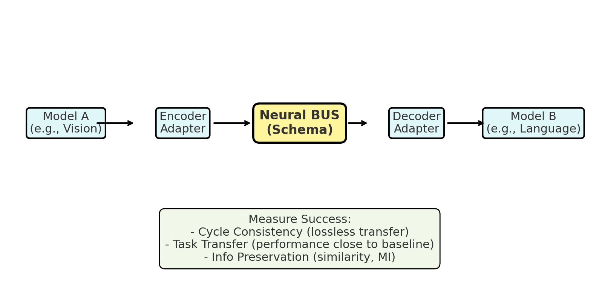

# Neural BUS — Distilled Model‑to‑Model Communication

> **Elevator pitch:** A plug‑and‑play **neural BUS** (schema + adapters + router) that lets one AI model (e.g., Vision) transfer usable internal state to another (e.g., Language), **distilled** to be compact and task‑preserving — like brain regions exchanging signals.



## Why this matters
Today, models talk through **lossy text only** (captions, transcripts). The Neural BUS standardizes a **richer, measured** hand‑off (symbolic triples, embeddings, optional tensors) with **knowledge distillation** so the receiving model performs nearly as well as if it had the original input.

## Core idea (one screen)
- **Schema**: A universal packet with multiple “views” (symbolic, vector, optional tensor, text) + provenance.
- **Adapters**: Per‑model encoders/decoders that map internal states ↔ BUS views.
- **Router**: Capability registry + dispatch (A→B) for tasks.
- **Distillation**: Train the BUS pathway (student) to match a stronger teacher pipeline (logits/hidden states).
- **Metrics**: Cycle consistency, task transfer accuracy, and information preservation.

---

## Repo structure
### Distillation Pipeline Architecture Repo
```
Neural-BUS/
├── README.md
├── requirements.txt
├── config.yaml
├── data/
│   ├── vqa_dataset.py           # VQA / COCO loader
│   └── transforms.py            # image preprocessing
├── models/
│   ├── vision_encoder.py        # ResNet/ViT feature extractor
│   ├── captioner.py             # BLIP / detector for text+symbolic
│   ├── llm_decoder.py           # LLM wrapper (Mistral/Llama etc.)
│   └── adapters/                # EncoderAdapter & DecoderAdapter
│       ├── encoder.py
│       └── decoder.py
├── bus/
│   ├── schema.py                # BUS packet definition (JSON/Proto)
│   ├── router.py                # simple A→B routing
│   └── compression.py           # optional: packet compression/ quantization
├── eval/
│   ├── cycle_consistency.py     # cosine/MSE/SSIM
│   ├── task_transfer.py         # VQA accuracy vs baselines
│   ├── info_metrics.py          # MI (MINE), KL, CKA/CCA
│   └── ablation.py              # drop views, re-measure
├── scripts/
│   ├── run_pipeline.py          # end‑to‑end demo
│   ├── train_adapters.py        # distillation + cycle losses
│   └── evaluate.py              # collects and prints metrics
├── training/
│   ├── losses.py                # cycle, distillation, alignment losses
│   ├── trainer.py               # main training loop
│   └── optimization.py          # schedulers, optimizers
├── utils/
│   ├── visuzliation.py          # plot embeddings, attention maps
│   ├── logging.py               # structured logging utilities
│   └── checkpoints.py           # model saving/loading
├── results/
    ├── logs/
    ├── metrics.json
    └── figures/
└── webapp/
```

### Demo Frontend/Backend Repo
```
webapp/                     
├── backend/                 
│   ├── app.py               # FastAPI/Flask main application
│   ├── api/
│   │   ├── routes.py        # API endpoints (/process, /metrics, etc.)
│   │   └── models.py        # Pydantic models for requests/responses
│   ├── services/
│   │   ├── pipeline.py      # Neural-BUS pipeline wrapper
│   │   ├── image_handler.py # Image upload/processing
│   │   └── metrics.py       # Real-time metric calculation
│   └── config.py            # Backend configuration
├── frontend/
│   ├── public/
│   │   ├── index.html       # Your demo interface
│   │   ├── style.css        # Styling (or embed in HTML)
│   │   └── script.js        # Frontend logic
│   └── assets/              # Images, icons, etc.
├── docker/
│   ├── Dockerfile.backend   # Backend containerization
│   ├── Dockerfile.frontend  # Frontend containerization  
│   └── docker-compose.yml   # Full stack deployment
└── requirements-web.txt     # Web-specific dependencies
```
---

## Quickstart

### 1) Environment
```bash
python -m venv .venv && source .venv/bin/activate
pip install -r requirements.txt
```

### 2) Minimal demo (no training)
```bash
python scripts/run_pipeline.py   --image path/to/example.jpg   --question "What color is the cup?"   --vision resnet50   --llm mistral-7b
```

**What happens:**  
Image → **Vision Encoder** → **EncoderAdapter** → **BUS packet (vector + caption + symbolic)** → **DecoderAdapter** → **LLM** → Answer.

### 3) Distillation training (teacher → student)
Teacher = your best baseline (e.g., BLIP caption → LLM QA).  
Student = **BUS-fed** pathway.

```bash
python scripts/train_adapters.py   --dataset vqa   --teacher blip2_qa_pipeline   --student bus_pipeline   --epochs 3   --batch-size 16   --loss-weights 1.0 1.0 0.5 0.5
```
Composite loss:

L_total = λ_cycle * L_cycle + λ_KD * L_KD + λ_hidden * L_hidden + λ_sym * L_symbolic

Where:
- L_cycle   = || Φ_A(x) − D(Enc(Φ_A(x))) ||²
- L_KD      = T² * KL( softmax(y_T/T) || softmax(y_S/T) )
- L_hidden  = || P·h_S − h_T ||²
- L_symbolic = supervised cross-entropy on objects/relations


### 4) Evaluate
```bash
python scripts/evaluate.py --dataset vqa --split val
```
This prints:
- **Cycle Consistency**: cosine ↑, MSE ↓  
- **Task Transfer**: VQA Accuracy (%), Δ vs baseline  
- **Information Preservation**: MI lower bound, CKA/CCA  
- **Ablation**: performance when each view is removed

---

## BUS packet (minimal JSON)
```json
{
  "header": {"source":"vision.v1","intent":"vqa"},
  "payload": {
    "vector": {"dim": 512, "data": "…"},
    "symbolic": { "triples": [["cup","on","table"]], "attributes": {"cup":{"color":"red"}} },
    "text": "A red cup sits on a wooden table."
  },
  "provenance": {"model_commit":"resnet50@abc123"},
  "controls": {"confidence": 0.92}
}
```

---

## Datasets & Models
- **Datasets:** VQA v2 (subset), MS‑COCO captions for warm‑up.  
- **Vision (A):** torchvision **ResNet‑50** or ViT‑B/16 (HF).  
- **Language (B):** 7B‑class LLM (Mistral/LLaMA; int8/4‑bit OK).  
- **Captioner/Detector:** BLIP/BLIP‑2 (caption), YOLO/DETR (symbolic).

> Tip: Start with vector + text views. Add symbolic and (optionally) tensors later.

---

## Results template
| Method | VQA Acc. ↑ | Δ vs Baseline ↓ | Cosine (cycle) ↑ | MI (lower bound) ↑ | Packet Size (KB) ↓ |
|-------:|:-----------:|:----------------:|:----------------:|:------------------:|:------------------:|
| Caption‑only baseline |  |  |  |  |  |
| BUS (vector+text) |  |  |  |  |  |
| BUS (+symbolic) |  |  |  |  |  |
| BUS (+tensor) |  |  |  |  |  |

---

## Roadmap
- [ ] MVP: ResNet → BUS (vector+text) → LLM QA
- [ ] Add symbolic triples via detector
- [ ] Distill logits from teacher pipeline
- [ ] Cycle reconstruction of A‑features
- [ ] Ablation suite + info metrics
- [ ] Optional: tiny router + registry (multi‑region)
- [ ] Paper write‑up / poster

---

## Course Deliverables (UM CSCI 487 – Fall 2025)
- **Sep 5:** Prospectus  
- **Sep 7:** Start coding MVP  
- **Sep 26:** Project Requirements  
- **Sep 29:** Status Report 2 – *Initial Demo*  
- **Oct 27:** Status Report 4 – *Second Demo*  
- **Nov 7:** Design Spec  
- **Nov 30:** User Manual  
- **Dec 1–5:** Final Oral Presentations  
- **Dec 7:** Final Report & Product Delivery

---

## Contributing (solo‑friendly)
- Issues labeled: `bug`, `enhancement`, `schema`, `eval`, `docs`  
- PR checklist: docs updated • unit test for new adapter • smoke test passes.

## License
MIT — please cite if you use this in academic work.

## Citation
```
@software{neural_bus_2025,
  title  = {Neural BUS: Distilled Model-to-Model Communication},
  author = {Visho Malla Oli},
  year   = {2025},
  url    = {https://github.com/<your-username>/Neural-BUS}
}
```
